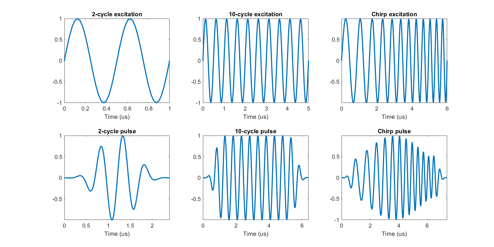

## Object oriented tools for Fullwave simulations

This repository contains an object-oriented wrapper for Fullwave and a demo script for usage. Fullwave is written by Gianmarco Pinton.

### Setup
* [fwObj()](fwObj.m) - Initialize simulation object by setting parameters keywords-style

### Methods
* [make_xdc()](make_xdc.m) - Initialize transducer properties
* [focus_xdc()](focus_xdc.m) - Calculate transmit focal delays and sets up initial conditions
* [add_wall()](add_wall.m) - Add abdominal wall in nearfield
* [add_speckle()](add_speckle.m) - Add scatterers to field, with option to include cysts of tunable size and scattering properties
* [add_points()](add_points.m) - Add point targets to field with varying impedance contrast 
* [add_fii_phantom()](add_fii_phantom.m) - Add Field II phantom using phantom output from [ultratrack](https://github.com/mlp6/ultratrack)
* [preview_sim()](preview_sim.m) - Preview acoustic map, focusing delays, and transmitted pulse
* [do_sim()](do_sim.m) - Perform simulation, with option to save channel data or field pressure distribution
* [make_acq_params()](make_acq_params.m) - Convert simulation parameters to `acq_params`, necessary for use with beamforming tools

### Helper scripts
* [extract_struct.m](extract_struct.m) - Extracts structure fields as individual variables in workspace
* [focus_transmit.m](focus_transmit.m) - Calculate transmit focal delays pixel-by-pixel
* [make_incoords_row.m](make_incoords_row.m) - Convert input map to input coordinates
* [get_delays.m](get_delays.m) - Retrieve element-by-element delays in transmit

### Workflow
* Call `fwObj()` to initialize the simulation object-oriented
* Set transducer properties and call `make_xdc()`
* Define the focus and call `focus_linear()`
* If desired, change the field maps via `add_wall()`, `make_speckle()`, `make_points()`, or `add_fii_phantom()`
* Run the simulation with `do_sim()`

### Example set up
* [setup_example.m](setup_example.m) - Example usage with varying focal configurations and simple field map changes

```
%%% Create fwObj %%%%%%%%%%%%%%%%%%%%%%%%%%%%%%%%%%%%%%%%%%%%%%%%%%%%%%%%%%
c0 = 1540;                                  % Homogeneous speed of sound
f0 = 2e6;                                   % Transmit center frequency (Hz)
wZ = 8e-2;                                  % Axial extent (m)
wY = 6e-2;                                  % Lateral extent (m)
td =(wZ+1e-2)/c0;                           % Time duration of simulation (s)
sim = fwObj('c0',c0,'f0',f0,'wY',wY,'wZ',wZ,'td',td);
```
First, we will call `fwObj()` to initialize the simulation object. In this example, we have specified the homogeneous speed of sound, transmit center frequency, axial and lateral extents of the field, and the time duration of simulation.

```
%%% Specify transducer and transmit parameters %%%%%%%%%%%%%%%%%%%%%%%%%%%%
sim.xdc.type = 'linear';                    % Curvilinear or linear
sim.xdc.pitch = 0.000412;                   % Center-to-center element spacing
sim.xdc.n = 64;                             % Number of elements
sim.make_xdc();                             % Call make_xdc to set up transducer
```
Next, we will set transducer properties and call `make_xdc()` to configure the remaining properties. The transducer type, pitch, kerf, and number of elements is required.

```
%%% Focused transmit %%%%%%%%%%%%%%%%%%%%%%%%%%%%%%%%%%%%%%%%%%%%%%%%%%%%%%
focus = [0 0.03];                           % Focal point in [y z] (m)
sim.focus_xdc(focus);                       % Call focus_linear to calculate icmat

%%% Plane transmit %%%%%%%%%%%%%%%%%%%%%%%%%%%%%%%%%%%%%%%%%%%%%%%%%%%%%%%%
th = 15;                                    % Angle for plane wave transmit (degrees)
focus = 10*[sind(th) cosd(th)];             % Very far focus to flatten delays
sim.focus_xdc(focus);                       % Call focus_linear to calculate icmat

%%% Diverging transmit %%%%%%%%%%%%%%%%%%%%%%%%%%%%%%%%%%%%%%%%%%%%%%%%%%%%
focus = [0 -0.03];                          % Negative focus for diverging in [y z] (m)
sim.focus_xdc(focus);                       % Call focus_linear to calculate icmat
```
`focus_xdc()` is called to calculate focal delays in transmit and set up the initial condition matrix (`icmat`). Plane wave transmit is achieved with a large focal distance relative to the field extent; diverging wave transmit is achieved with a negative focal depth.
The corresponding `icmat` and element-wise focal delays can be seen here:


```
%%% 2-cycle pulse %%%%%%%%%%%%%%%%%%%%%%%%%%%%%%%%%%%%%%%%%%%%%%%%%%%%%%%%%
focus = [0 0.03];                           % Focal point in [y z] (m)
sim.focus_xdc(focus);                       % Call focus_linear to calculate icmat

%%% 10-cycle pulse %%%%%%%%%%%%%%%%%%%%%%%%%%%%%%%%%%%%%%%%%%%%%%%%%%%%%%%%
sim.input_vars.ncycles = 10;
sim.make_xdc();                             % Call make_xdc to set up transducer
focus = [0 0.03];                           % Focal point in [y z] (m)
sim.focus_xdc(focus);                       % Call focus_linear to calculate icmat

%%% Chirp %%%%%%%%%%%%%%%%%%%%%%%%%%%%%%%%%%%%%%%%%%%%%%%%%%%%%%%%%%%%%%%%%
flow = 1e6; fhigh = 3e6;
t = 0:sim.grid_vars.dT:6e-6; 
k = (pi/max(t))*(fhigh-flow);
phi = k*t.^2;
excitation = sin(2*pi*flow*t+phi);
sim.focus_xdc(focus,[],[],excitation); 
```
The excitation may be altered by changing the `ncycles` input variable or manually defining an excitation sequence prior to calling `focus_linear()`. Here, the default 2-cycle pulse is shown with a 10-cycle and chirp variant:


```
%%% Add abdominal wall with lateral offset %%%%%%%%%%%%%%%%%%%%%%%%%%%%%%%%
wall_name = 'r75hi';                        % Mast abdominal wall name
offset = 0.01;                              % Lateral offset from center (m)
sim.add_wall(wall_name,offset);
```
A Mast abdominal wall can be added in the nearfield using `add_wall()`. Here, we add one with a lateral offset of 1 cm.

```
%%% Add speckle and cysts of varying impedance contrasts %%%%%%%%%%%%%%%%%%
cC = 1e-3*[-15 50; -5 50; 5 50; 15 50];    % Locations of cyst centers in [y z] (m)
rC = 0.004*ones(size(cC,1),1);             % Radii of cysts (m)
zC = [0 0.025 0.075 0.1]';                 % Cyst relative impedance contrast
sim.add_speckle('nscat',50,'csr',0.05,'nC',length(rC),'cC',cC,'rC',rC,'zC',zC);
```
Scattering and cyst targets can be added by calling `make_speckle()`. The impedance mismatch, scattering density, and cyst size and location can be adjusted. Combining the scatterers with the abdominal wall, we arrive at the following `cmap`:


```
%%% Collect single transmit channel data %%%%%%%%%%%%%%%%%%%%%%%%%%%%%%%%%%
t = tic;
rf_data = double(sim.do_sim());
fprintf('   Channel data generated in %1.2f seconds \n',toc(t))
```
Finally, the simulation is run by calling `do_sim()`. Here, we collect single transmit channel data.

### Demo
A simple demo for a 1 MHz pulse focused at 4 cm through an abdominal wall can be found in [demo.m](demo.m).

### References
* Fullwave: [Pinton, G. F., Dahl, J., Rosenzweig, S., & Trahey, G. E. (2009). A heterogeneous nonlinear attenuating full-wave model of ultrasound. IEEE transactions on ultrasonics, ferroelectrics, and frequency control, 56(3).](https://ieeexplore.ieee.org/abstract/document/4816057)
* Impedance flow for Fullwave: [Pinton, G. F. (2017). Subresolution Displacements in Finite Difference Simulations of Ultrasound Propagation and Imaging. IEEE transactions on ultrasonics, ferroelectrics, and frequency control, 64(3), 537-543.](https://ieeexplore.ieee.org/abstract/document/7781628)
* Abdominal wall models: [Mast, T. D., Hinkelman, L. M., Orr, M. J., Sparrow, V. W., & Waag, R. C. (1997). Simulation of ultrasonic pulse propagation through the abdominal wall. The Journal of the Acoustical Society of America, 102(2), 1177-1190.](https://asa.scitation.org/doi/abs/10.1121/1.421015)

